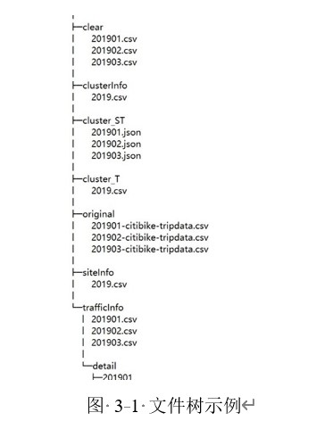
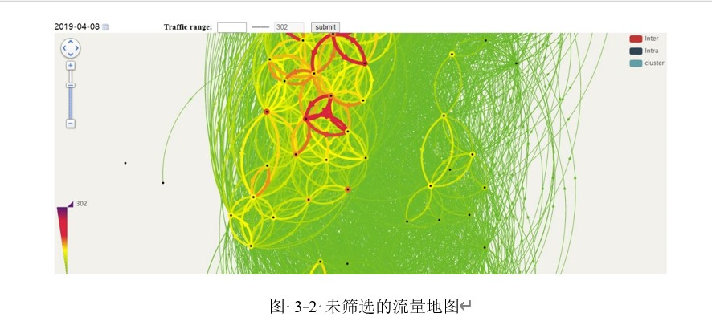
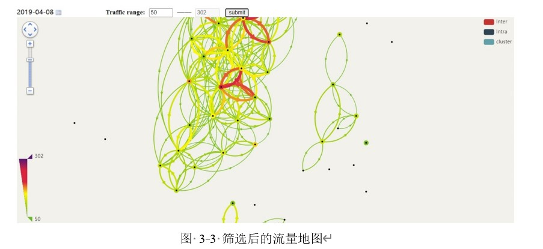
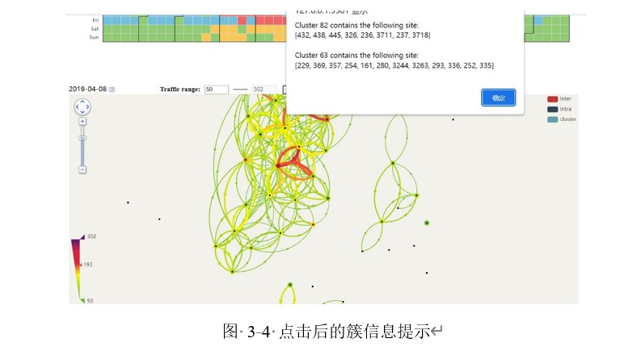
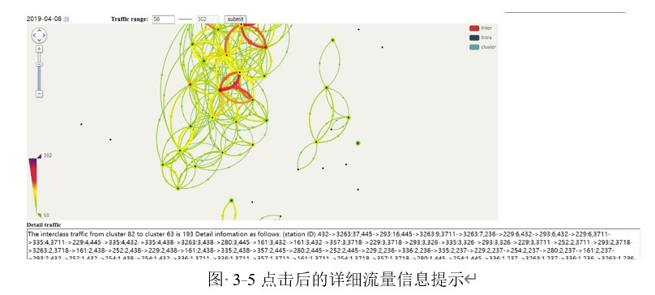
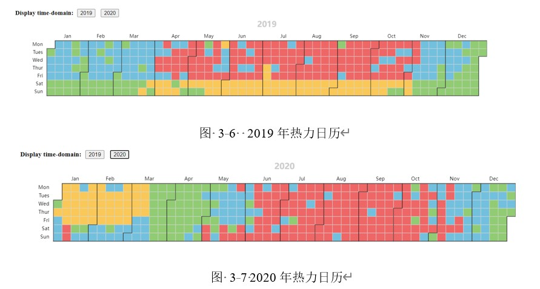

# 纽约自行车数据分析

## 开发环境
- Windows
- conda(64bit) 22.9.0
- python(64bit) 3.9.15

## 依赖项
- pandas 1.5.2
- numpy 1.23.5
- scikit-learn 1.1.3
- pyecharts 1.9.1
- matplotlib 3.6.2
- pympler 1.0.1

## 注意
- 数据网站：https://www.citibikenyc.com/system-data
- 建议将工程目录建立在`citibikenyc`下运行相关程序，否则可能会需要修改部分路径字符串
- 原始数据请放于`citibikenyc/data/original`目录下，文件名保持和下载解压后一致，无需另外修改
- 最终呈现文件为`preview.html`，运行时请保证`preview.html`、预处理后的data目录、static目录三者在同一host及同一port下，否则将会出现跨域问题
- 由于使用的大多数外部js文件并没有下载到本地，即通过远程URL访问的方式来使用，故运行结果文件`preview.html`时需要**联网**
- 默认情况数据看板仅支持2019和2020两年的数据，如需进行更多数据的可视化展示，请进行以下修正
  - 修改年：请在`citibikenyc\preview.html`中找到`<button>2020</button>`一行，按照此行格式在其下方添加空行后输入添加需要的年份

## 系统相关
### static
- 此目录下为前端数据可视化显示中需要调用或其他部分需要使用的静态资源
### process
- 此模块为数据处理模块（含预处理、特征提取、聚类挖掘等）
- 其demo文件为`citibikenyc/prep.py`
- 运行`prep.py`时，终端上除正常的进度提示信息外，可能还会提示FutureWarning和UserWarning的信息
  - FutureWarning：目前可以不必理会
  - UserWarning：**请确保运行机器的可用进程在其全部进程的四分之一以上**，此警告的产生主要是因为sklearn库中的KMeans在使用MKL的Windows上可能会出现内存泄漏问题。[^supplement_1]
      [^supplement_1]:由于此处在时空聚类处使用了进程池进行加速，其警告信息后可能会出现有关`OMP_NUM_THREADS`的相关建议
### 预期效果
  
  
  
  
  
  

## 练习部分
  > 因后续修改为按年聚类，故生成的文件树结构可能会有所不同，部分路径需要修改后才能正常使用
### basic_analysis
- 此模块主要是前期练习pyecharts画图时制作，主要用于进行数据规律探索[^supplement_2]
    [^supplement_2]:由于尝试过来pyecharts的接口不够完善，部分需求实现不了，故后期直接采用echarts进行呈现
- 其demo文件为`citibikenyc/basic.py`，其生成文件为`preliminary.html`
- 运行`basic.py`前请确保已经进行过数据预处理工作中的前两步（清洗、基础信息表提取）
### cluster_assess
- 此模块为聚类算法评估模块
- 此模块开发程度一般，即实现得不够完善

## 参考
- 工具
  - [控制台|百度地图开放平台](https://lbsyun.baidu.com/apiconsole/key#/home)
  - [下载 - Apache ECharts](https://echarts.apache.org/zh/download.html)
  - [PyPI](https://pypi.org/)
- 文档
  - [Apache ECharts](https://echarts.apache.org/zh/index.html)
  - [pyecharts](https://pyecharts.org/)
  - [scikit-learn](https://scikit-learn.org/stable/index.html)
  - [Matplotlib](https://matplotlib.org/)
  - [SciPy](https://scipy.org/)
  - [pandas documentation](http://huiyan-fe.github.io/BMap-JavaScript-library/#BMapLib.CurveLine)
  - [objgraph](https://mg.pov.lt/objgraph/index.html)
  - [Pympler](https://pythonhosted.org/Pympler/)
  - [multiprocessing](https://docs.python.org/zh-cn/3/library/multiprocessing.html)
- 教程
  - [石墨文档汇总](https://shimo.im/docs/dPkpK7QBnlSNd8qO)
  - [colorbar 的设置](https://blog.csdn.net/weixin_43257735/article/details/121831188)
  - [社区发现算法综述](https://eason.blog.csdn.net/article/details/91352358)
        